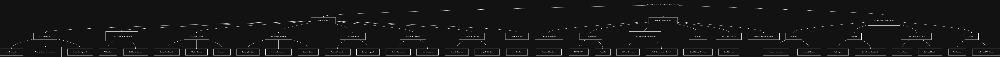

# 🏠 Airbnb Clone Backend — User Stories

## 🎯 Objective
This document outlines the **user stories** derived from the **Use Case Diagram** created in Draw.io.  
The goal is to describe the main functionalities and interactions that different users (Guests, Hosts, and Admins) will have with the backend system of the Airbnb Clone project.

---

## 👥 Actors
- **Guest** — A user who books and reviews properties.  
- **Host** — A user who lists and manages properties.  
- **Admin** — A system administrator responsible for managing users, listings, and overall system activities.

---

## 📚 User Stories

### 1. User Registration and Authentication
> **As a guest or host**, I want to register and log into my account so that I can securely access my profile, list properties, or make bookings.

**Acceptance Criteria:**
- Users can sign up using email and password.
- System should validate credentials and return JWT token on success.
- OAuth login (Google/Facebook) should be supported.

---

### 2. Property Listing Management
> **As a host**, I want to add, edit, and delete my property listings so that I can keep my available properties up to date for potential guests.

**Acceptance Criteria:**
- Hosts can create, update, and delete property listings.
- Each listing includes title, description, price, amenities, and availability.
- Only the property owner can edit or delete their listings.

---

### 3. Property Search and Booking
> **As a guest**, I want to search for properties by location, price, and amenities so that I can find suitable accommodation for my stay.

**Acceptance Criteria:**
- Guests can search using filters (location, price range, guest count, amenities).
- Results should support pagination.
- Guests can select a property and view full details before booking.

---

### 4. Booking Confirmation and Payment
> **As a guest**, I want to make payments for my bookings using a secure payment gateway so that my reservation can be confirmed instantly.

**Acceptance Criteria:**
- Guests can book available dates.
- Double bookings are prevented.
- Payment is processed securely via Stripe or PayPal.
- Guests and hosts receive booking confirmation notifications.

---

### 5. Review and Rating System
> **As a guest**, I want to leave reviews and ratings for the properties I’ve stayed in so that other users can make informed booking decisions.

**Acceptance Criteria:**
- Guests can review properties after a completed stay.
- Reviews are tied to verified bookings.
- Hosts can respond to reviews.

---

### 6. Admin Management Dashboard
> **As an admin**, I want to manage users, property listings, and transactions so that I can ensure the platform runs smoothly and securely.

**Acceptance Criteria:**
- Admin can view, approve, or remove listings.
- Admin can manage users (activate, suspend, or delete accounts).
- Admin can view and monitor all transactions.

---

### 7. Notification System
> **As a user**, I want to receive notifications and email alerts for booking confirmations, cancellations, or payment updates so that I stay informed about my activities.

**Acceptance Criteria:**
- Notifications are triggered for key events (bookings, cancellations, payments).
- Email notifications are sent using third-party services like SendGrid or Mailgun.

---

## 🧩 Reference
- Use Case Diagram: [`use-case-diagram/use-case-diagram.png`](../use-case-diagram/use-case-diagram.png)
- Project Requirements: [`project-requirements/README.md`](../project-requirements/README.md)

---

## 🖼️ Screenshot
Below is a preview of the **Use Case Diagram** that guided the creation of these user stories:



---

## 🧱 Repository Structure
```

alx-airbnb-project-documentation/
│
├── use-case-diagram/
│   └── use-case-diagram.png
│
├── user-stories/
│   └── README.md   ← (this file)
│
└── project-requirements/
└── README.md

```

---

## ✍️ Author
**Busari Abdulhakeem Tunde (Alphakeem Adroit)**  
Backend Developer | ALX Software Engineering Program  
📧 [Contact via GitHub](https://github.com/Alphakeem-Adroit)
